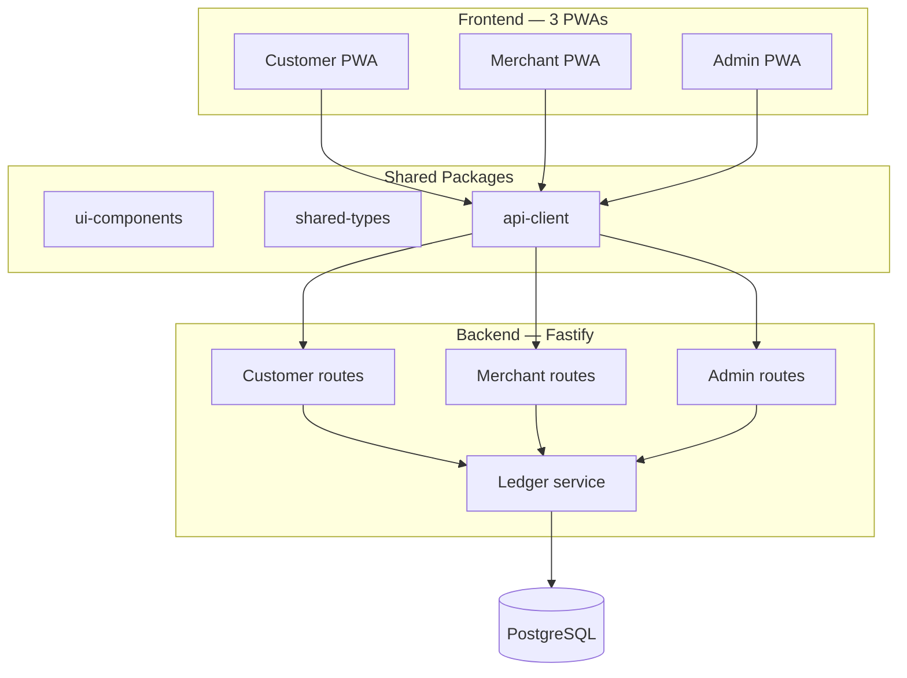

<div align="center">
  <br />
  <h1>MS Pay</h1>
  <p>
    <strong>A semi-closed virtual currency wallet system where consumers don't need a phone to pay.</strong>
  </p>
  <p>
    <a href="#features">Features</a> •
    <a href="#architecture">Architecture</a> •
    <a href="#repository-structure">Repository Structure</a> •
    <a href="#documentation">Documentation</a>
  </p>
  <br />
</div>


## 📖 Overview

**MS Pay** is a multi-merchant virtual currency (MSP) wallet designed for maximum accessibility and uncompromised financial security. 

It solves a critical gap in digital payments: **A consumer does not need a smartphone, an app, or an internet connection to pay.** With just a physical ID/QR card and a passcode, consumers can securely transact at any participating merchant. 

For users who *do* have smartphones, MS Pay provides a rich, polished PWA to approve requests remotely, recharge their wallets, and maintain complete control over their funds. Under the hood, a rigorous double-entry accounting system ensures every fraction of an MSP is perfectly reconciled.

---

## ✨ Key Features

### 🏦 For Consumers
- **Device-less Payments**: Pay securely at any merchant using only an ID/QR card and a passcode.
- **Scan & Pay (Mode B)**: Fully autonomous payments via the MS Pay Customer app.
- **Request & Approve (Mode C)**: Review and approve merchant payment requests remotely, eliminating the need to blindly trust a merchant's screen.
- **Real-time Cash-in**: Hand physical cash to a merchant and receive an instantly verified digital credit to your wallet.

### 🏪 For Merchants
- **Seamless Collection**: Fast checkout using a merchant-assisted flow (Mode A) or static store QRs (Mode B).
- **Remote Tab Management**: Request payments from consumers asynchronously.
- **Cash-in Agent Capabilities**: Act as a cash deposit agent to formalize consumer funds, strictly reconciled via the merchant float ledger.
- **Live Settlement Visibility**: Transparent tracking of live balance, collected cash, and net settlement owed.

### 🛡️ Core Financial Safety
- **Double-Entry Ledger**: A strict, auditable chart of accounts mapping every transaction type.
- **Zero Offline Credits**: Preventing fabricated funds by ensuring all credit-producing actions are strictly online and synchronous.
- **Atomic Operations**: All wallet mutations execute within atomic database transactions with mandatory idempotency keys.
- **Reconciliation Invariant**: A release-blocking automated check ensuring Assets + Expenses exactly match Liabilities + Equity + Revenue.

---

## 🏗️ Architecture

MS Pay enforces a strict **"three surfaces, one domain core"** rule. No frontend app is allowed its own divergent balance-mutation logic.



---

## 📂 Repository Structure

This project is structured as a **pnpm workspace** monorepo:

```text
mansula-pay/
├── apps/
│   ├── customer-pwa/      # React + Vite (Customer App)
│   ├── merchant-pwa/      # React + Vite (Merchant App)
│   ├── admin-pwa/         # React + Vite (Standalone Admin Dashboard)
│   └── api/               # Fastify + TypeScript backend
├── packages/
│   ├── ui/                # Shared UI components & Sora design tokens
│   ├── types/             # Shared TS types (Transaction, Wallet, etc.)
│   └── api-client/        # Typed fetch wrapper shared by all PWAs
├── docs/                  # Project specifications & architecture docs
├── prisma/                # Database schema & migrations
└── docker-compose.yml     # Local Postgres setup
```

---

## 📚 Documentation

The system is extensively documented. Please review these before making any structural changes:

1. **[Product Requirements Document](docs/project-req-doc.md)** - Payment modes, funding modes, and the double-entry accounting rules.

---
<div align="center">
  <i>Built with uncompromising focus on financial correctness and user accessibility.</i>
</div>
