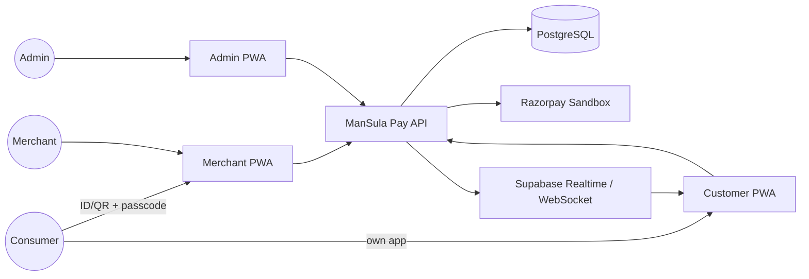
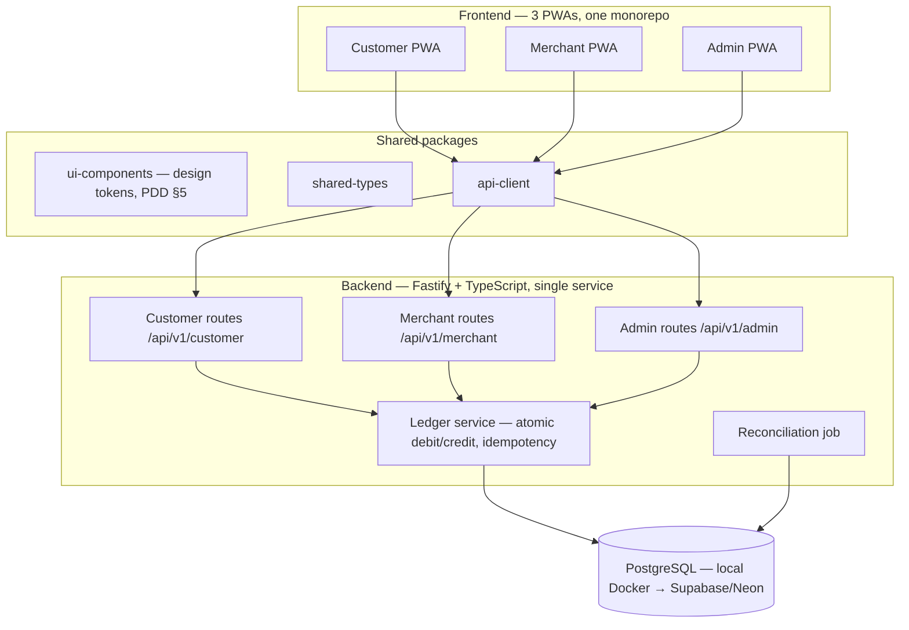
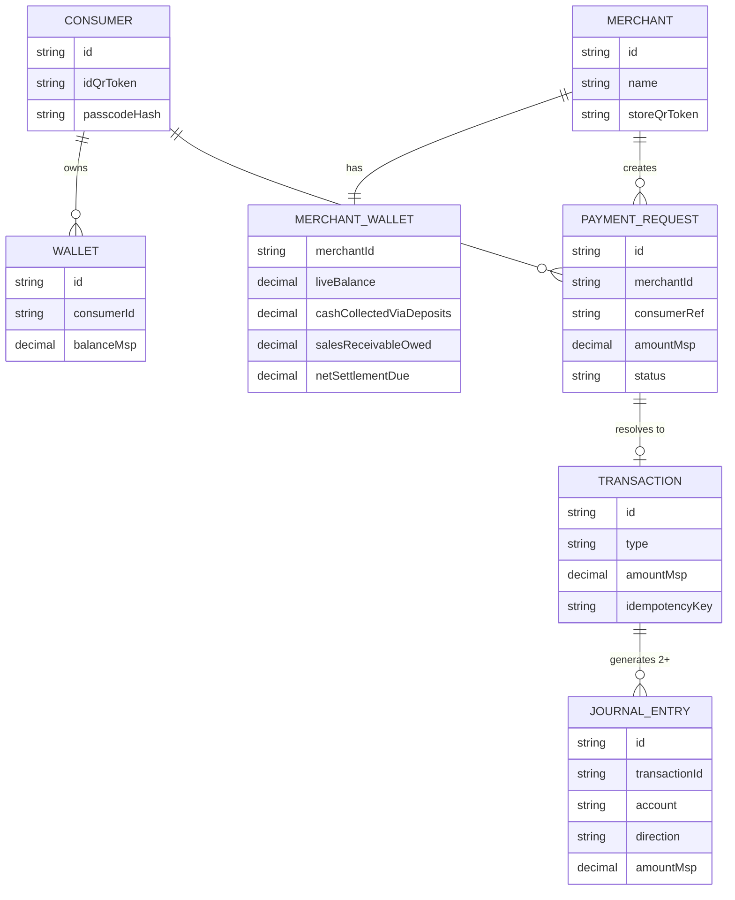
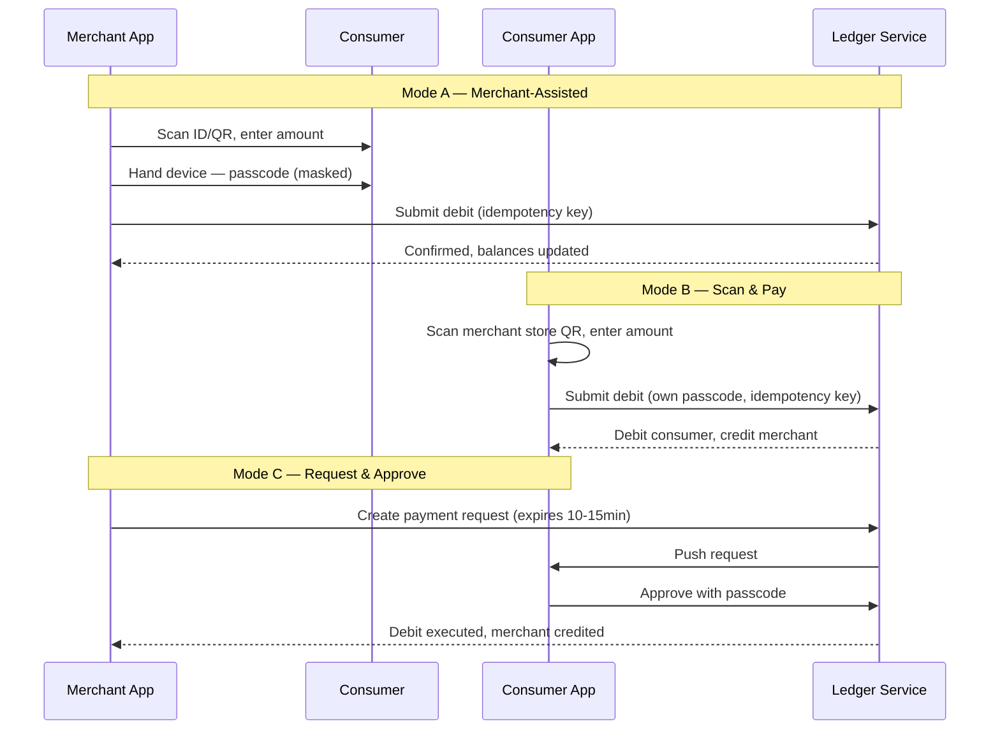

# ManSula Pay — Local Wallet Module
## System Architecture Document (SAD) v1

*Synthesized from: PRD v2, Project Design Document v1, and Tech Stack Document v1*
*Project posture: solo-built portfolio/showcase demo, not a production deployment (TSD §1, §19)*

---

## Table of Contents

1. Purpose & scope
2. System context
3. High-level architecture
4. Component architecture
5. Data architecture
6. Core domain flows
7. Money-safety architecture
8. Security architecture
9. Realtime & notification architecture
10. Deployment & environments
11. Non-functional characteristics & known limitations
12. Architecture decision log

---

## 1. Purpose & scope

This document describes **how the system is built and wired together** — the missing "system view" that sits between the PRD (*what* it must do) and the PDD (*how it should look*). It answers: what are the moving parts, how do they talk to each other, where does money-safety actually live in the code, and what are the deployment and security boundaries.

Scope is exactly the Local Wallet Module described in PRD v2: three payment modes (A/B/C), four funding modes, a merchant float/settlement model, and the double-entry ledger underneath all of it — delivered as three PWAs and one backend service.

---

## 2. System context

**Actors** (PRD §4):
- **Consumer** — may have no smartphone; authenticates via ID/QR + passcode only.
- **Merchant** — always has a connected device; both collects payments and acts as a cash-in agent.
- **Admin** — operates inside ManSula BOS for oversight, settlement, and risk review.

**External systems:**
- **Razorpay (sandbox)** — self-recharge payment rail (TSD §12), test-mode only.
- **Supabase** — Postgres hosting + Realtime + Auth, once migrated off local dev (TSD §7–9).



No actor ever mutates a balance directly — every action passes through the API's ledger service, which is the single point where money moves (Section 4.3, Section 7).

---

## 3. High-level architecture

One backend service, three route groups, one shared domain core — this is the architecture's central invariant (TSD §3): Customer, Merchant, and Admin must never touch divergent copies of the ledger logic.



Everything downstream of this document inherits from this one rule: **three surfaces, one domain core.**

---

## 4. Component architecture

### 4.1 Frontend apps (PDD §6, §7–9; TSD §5)

| App | Platform | Visual intensity | Primary responsibilities |
|---|---|---|---|
| Customer PWA | React + Vite, installable PWA | Full brand polish — gradient hero, low density | ID/QR display, Scan & Pay (Mode B), approve requests (Mode C), self-recharge, history |
| Merchant PWA | React + Vite, installable PWA | Same tokens, flattened, high contrast, one-handed | Collect payment (Mode A), create requests (Mode C), cash-in/advance entry, own ledger + settlement view |
| Admin PWA | React + Vite (PWA optional) | Brand as accent only, dense/tabular | Merchant float & settlement, reconciliation dashboard, risk flags, Mode C config, support tools |

All three consume the same `api-client` and `ui-components` packages so that shared concepts (status pills, QR components, passcode pad) stay visually and semantically identical across apps (PDD §10, §11).

### 4.2 Shared packages

- **`shared-types`** — one TypeScript definition per domain entity (`Transaction`, `PaymentRequest`, `MerchantWallet`, `JournalEntry`), imported by both frontend and backend so a schema change can't silently drift between what the API sends and what the UI expects.
- **`ui-components`** — the PDD §10 shared component library (balance hero card, transaction row, status pill, QR display, passcode pad, confirmation banner) plus the QR scanning component (`html5-qrcode`) reused identically by Customer (Mode B) and Merchant (Mode A) apps.
- **`api-client`** — a typed fetch wrapper; the only code path any frontend uses to reach the backend.

### 4.3 Backend service (TSD §6)

A single Fastify service, internally partitioned by actor, converging on one domain core:

- **Route groups** (`/customer/*`, `/merchant/*`, `/admin/*`) — thin controllers: validate input (Zod), check auth/role, call the ledger service, shape the response.
- **Ledger service** — the only code allowed to mutate a `Wallet`, `MerchantWallet`, or write a `JournalEntry`. Implements the PRD §9.3 double-entry journal as one function per transaction type, called by every route that touches money (all three sale modes, all four funding modes, refunds, settlement). No route group is allowed its own copy-pasted balance-mutation logic.
- **Reconciliation job** — a scheduled (and on-demand) process that runs the invariant query from PRD §9.3 against `JournalEntry` and reports pass/fail to the Admin dashboard (Section 7).

---

## 5. Data architecture

### 5.1 Operational schema (TSD §7, abridged Prisma model)

Core entities: `Consumer`, `Merchant`, `Wallet`, `MerchantWallet`, `PaymentRequest`, `Transaction`, `JournalEntry`. `Transaction` is the **activity log** (what happened); `JournalEntry` is the **financial log** (where the money sits and who has a claim on it) — PRD §9.3 is explicit that these are two different tables serving two different questions.



### 5.2 Chart of accounts (PRD §9.3)

| Account | Type | Meaning |
|---|---|---|
| Platform Bank/Cash | Asset | Real money the platform actually holds |
| Consumer Wallet Liability | Liability | MC owed to consumers |
| Merchant Settlement Payable | Liability | Real currency owed to a merchant for MC collected |
| Merchant Cash-in Receivable | Asset | Real currency owed *by* a merchant who credited a consumer with cash they kept |
| Platform Revenue (Commission) | Equity/P&L | Commission recognized at settlement |
| Promotional Expense | Equity/P&L | MC granted with no real money behind it |

### 5.3 Journal entry mapping (PRD §9.3)

Every route that moves MC writes a matching debit/credit pair through the ledger service — a sale never touches Platform Bank/Cash at all; it purely transfers liability from the consumer's claim to the merchant's claim. Real money only enters or leaves at recharge and at settlement, which is what makes the reconciliation invariant in Section 7 possible.

---

## 6. Core domain flows

### 6.1 Payment modes (PRD §5, PDD §7–8)



### 6.2 Funding modes (PRD §6)

Funding 1 (self-recharge) and 2 (admin top-up) credit a wallet from outside; Funding 3 (cash-in deposit) and 4 (advance credit) are **the same underlying mechanism** — a merchant crediting a consumer — tagged differently for traceability. All four share one hard rule enforced at both the UI and API layer: **credits are always synchronous and online, with no queued/offline path**, because an offline credit is indistinguishable from fabricated money (PRD §6, TSD §5, §18).

### 6.3 Settlement (PRD §9.2)

Two flows run in opposite directions and net against each other per merchant:

```
Net settlement for merchant M =
    Σ(Merchant Settlement Payable, M)
  − Σ(Merchant Cash-in Receivable, M)
  − Commission(M)
```

A positive result triggers a payout; a negative result becomes a carried-forward debit balance, visible in the merchant's own ledger view (PRD §9.1) — never a hidden admin-only number.

---

## 7. Money-safety architecture

This is the part of the system the TSD explicitly says is built to production-grade care regardless of demo scope (TSD §1, §2):

- **Idempotency** — every mutating endpoint requires an `Idempotency-Key` header, checked against a `processed_requests` table before the ledger service runs, preventing double-spend from retries or duplicate submissions (PRD §10, TSD §6).
- **Atomicity** — every wallet mutation runs inside a single Prisma `$transaction` (row lock → check → write → commit), so no payment mode can leave a partial write (PRD §10, TSD §6, §18).
- **Reconciliation invariant** — run nightly and on-demand, and treated as a release-blocking CI test, not a monitoring dashboard (PRD §9.3, TSD §11, §14):

```
Platform Bank/Cash + Σ(Merchant Cash-in Receivable)
  = Σ(Consumer Wallet Liability) + Σ(Merchant Settlement Payable) − Σ(Platform Revenue recognized)
```

If this fails, the admin dashboard's reconciliation screen (PDD §9.3) surfaces a red status card with drill-down to the affected account — this single check is the system's cheapest, highest-value fraud/bug detector.

---

## 8. Security architecture

| Concern | Mechanism | Reference |
|---|---|---|
| Consumer auth | ID/QR token + passcode (bcrypt/argon2 hash), short-lived JWT on success — no email/password | PRD §10, TSD §8 |
| Merchant/Admin auth | Supabase Auth (email+password) once migrated; role claim gates `/admin/*` | TSD §8 |
| QR tokens | Opaque UUIDs, never raw IDs | PRD §10, TSD §18 |
| Passcode handling | Never stored/logged in plaintext, masked on merchant-handed devices | PRD §10, PDD §11 |
| Passcode reset | In-person verification in the target design; modeled as admin-approval in this demo (explicitly flagged as a simplification) | PRD §10, TSD §8, §19 |
| Credit safety | No offline code path for any credit-producing action, enforced at both UI (disabled state) and API (rejects requests lacking a fresh server nonce) | PRD §6, TSD §5, §18 |
| Account lockout | After repeated failed passcode attempts | PRD §10 |

---

## 9. Realtime & notification architecture

- **In-app realtime** (incoming Mode C requests, live balance): Supabase Realtime (Postgres change subscriptions) in the hosted phase; `@fastify/websocket` locally (TSD §9).
- **Push notifications**: Web Push via the PWA service worker — specifically for the cash-in/advance trust-confirmation moment (PRD §6), which the TSD treats as a hard UX requirement, not a nicety, since it's the consumer's only independent proof a cash handoff was recorded correctly.
- **PWA offline behavior**: the service worker caches the app shell for installability and fast reload, but the offline UI state for any credit-producing action is a disabled button with a clear "you're offline" message — never a silently-queued background-sync action (TSD §5).

---

## 10. Deployment & environments

| Piece | Local/dev | Hosted (demo) |
|---|---|---|
| Frontend (×3 PWAs) | Vite dev server | Vercel (free tier, 3 projects from one monorepo) |
| Backend API | Fastify on localhost | Render or Fly.io (free tier; cold-start on idle) |
| Database | PostgreSQL via Docker Compose | Supabase or Neon (Postgres, connection-string swap only) |
| Scheduled job | `node-cron` inside the Fastify process | Same, or `pg_cron` directly against `JournalEntry` once on Supabase |
| CI/CD | — | GitHub Actions: install → migrate → test (incl. reconciliation invariant) → build |

Repository is a single pnpm-workspace monorepo (`apps/customer-pwa`, `apps/merchant-pwa`, `apps/admin-pwa`, `apps/api`, `packages/ui`, `packages/types`, `packages/api-client`) — TSD §4.

---

## 11. Non-functional characteristics & known limitations

Stated upfront per TSD §19, because a demo project is more credible admitting its own scope than implying otherwise:

- No real money moves — Razorpay stays in sandbox/test mode throughout.
- No formal PPI/semi-closed-wallet compliance review (PRD §11) — this is a "semi-closed" wallet by definition (multi-merchant redemption), which is noted for accuracy, not because it's currently in scope.
- No real in-person identity verification for passcode reset — simulated as admin approval.
- Single-instance, free-tier hosting — no horizontal scaling, load testing, or multi-region setup, intentionally.
- Cash-in anomaly flagging is rule-based (simple thresholds), not a trained fraud model.

---

## 12. Architecture decision log

Condensed rationale for the choices that shape this architecture (TSD §2, §6, §7):

| Decision | Chosen | Rejected alternative | Why |
|---|---|---|---|
| Backend framework | Fastify | NestJS | Solo-dev velocity over enterprise ceremony at this scale |
| ORM | Prisma | Drizzle / hand-rolled | Fastest way for one person to keep schema, types, and DB in lockstep as the data model evolves |
| Money-mutation code path | One `ledger` service, all routes funnel through it | Per-route balance logic | The one architectural rule the whole system depends on — no divergent copies of financial logic |
| Domain logic location | Shared backend service, three route groups | Three separate backends per app | Ledger correctness can never differ by which app touched it |
| Validation | Zod, shared between frontend and backend | Separate frontend/backend validation | One source of truth for "what a valid payment amount looks like" |
| Language | TypeScript everywhere | Mixed stack | Zero runtime type-mismatch surprises across a 3-frontend + 1-backend monorepo |
| Offline strategy | Debits eventually tolerable offline (roadmap); credits never | A unified offline story | An offline credit is indistinguishable from fabricated money — this is a hard rule, not a tuning knob |
