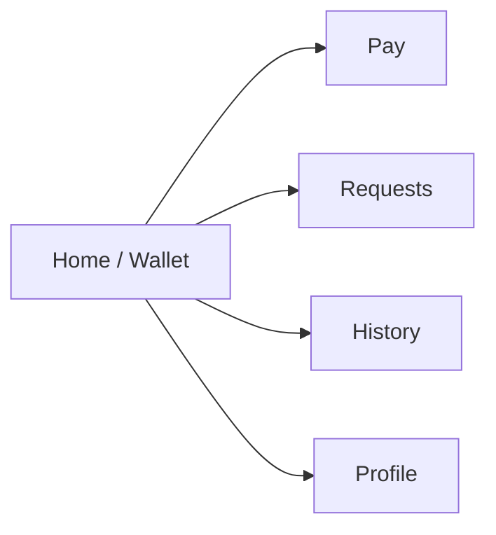
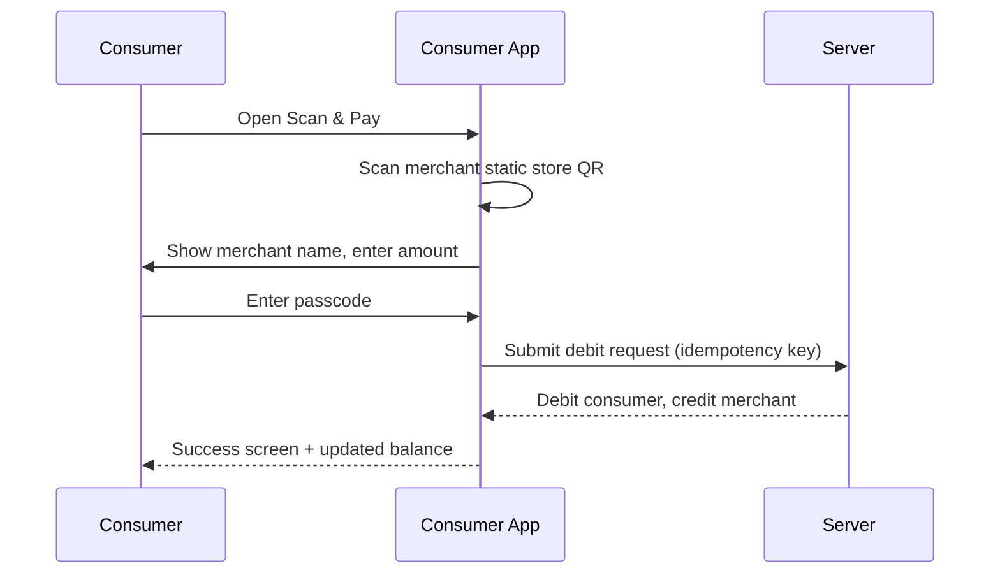
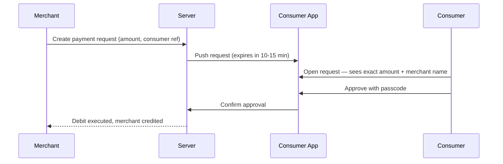
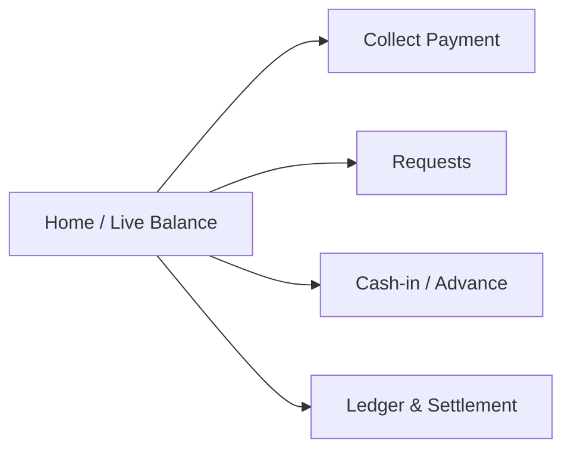
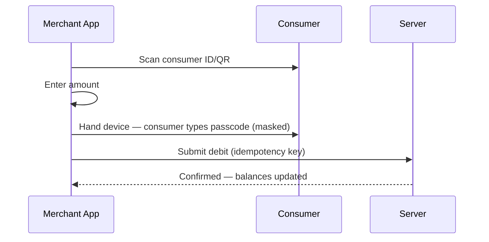
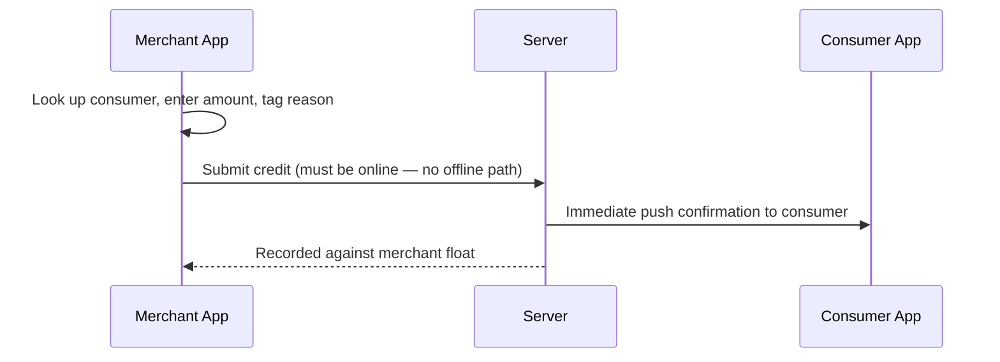
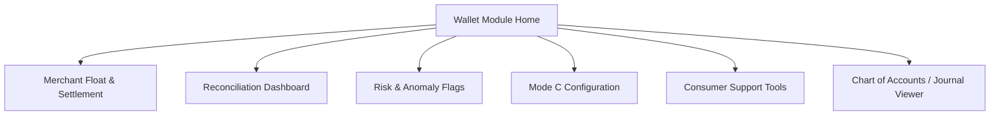
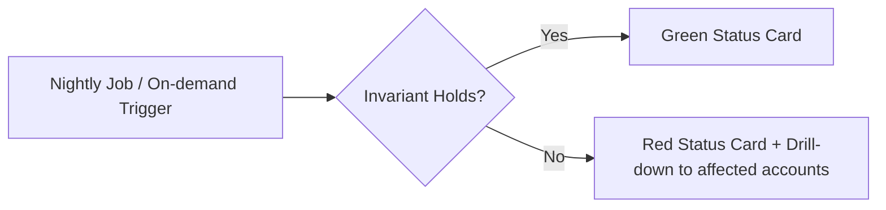

# MS Pay — Local Wallet Module
## Project Design Document (PDD) v1

*Companion document to: MS Pay — Local Wallet Module PRD v2*
*Visual/UX inspiration reference: "Quantra — Smart Finance App" (Behance UI/UX case study)*
*Scope: Customer App · Merchant App · Admin (Standalone back office)*

---

## Table of Contents

1. Purpose of this document
2. Why Quantra works as a reference — and where it needs adapting
3. Design direction summary
4. Assumptions baked into this PDD (please confirm)
5. Brand & visual system
6. One brand, three experiences
7. Customer App — design spec
8. Merchant App — design spec
9. Admin (Web Back Office) — design spec
10. Shared component library / design tokens
11. Accessibility & trust-specific design notes
12. Screen count estimate & delivery roadmap
13. Open questions
14. Next steps

---

## 1. Purpose of this document

The PRD (v2) defines *what* the product must do: three payment modes (A/B/C), four funding modes, a merchant float/settlement model, and a double-entry ledger underneath all of it. This PDD defines *how it should look and feel*, and how that one visual language flexes across three very different users of the system:

- A **consumer** who may have no smartphone at all, or may have full control via their own app.
- A **merchant** operating at a counter, mid-transaction, often one-handed.
- An **admin** operator in the standalone dashboard doing reconciliation, settlement, and risk review.

Every screen and flow named below traces back to a specific PRD section, so nothing here is decorative — it's the PRD, given a face.

---

## 2. Why Quantra works as a reference — and where it needs adapting

**What to borrow:**
- A warm coral → magenta → orange gradient identity instead of the default finance-app blue/navy/green — this reads as approachable rather than "corporate bank," which matters for a wallet meant to be usable by people without much digital experience.
- Card-based balance dashboard: hero balance card, quick-action row, recent activity feed — a near-direct fit for the Customer home screen.
- A disciplined, consistent icon system across a large screen set (Quantra ships 42+) — this project needs the same discipline across three apps.

**What not to copy directly:**
- Large numerals should never sit directly on a busy gradient — contrast has to be bulletproof for a balance figure someone is reading mid-transaction. Gradient stays as brand skin (splash, headers, hero card *frame*); the number itself sits on a solid, darkened panel inside that card.
- Quantra is single-persona. This product is three personas with different constraints — see §6. The Customer app earns the full lifestyle treatment; Merchant and Admin inherit the same DNA at reduced visual intensity, tuned for speed and density respectively.
- The reference doesn't depict QR scanning, "approve this request," or a cash-in confirmation moment — the actual differentiating screens of this product. These are designed fresh in §7–§9, not reskinned from the reference.

---

## 3. Design direction summary

| Layer | Treatment |
|---|---|
| Customer App | Full Quantra-level visual polish: gradient hero cards, bold rounded typography, generous whitespace, large touch targets |
| Merchant App | Same tokens, flattened: higher contrast, solid color CTAs, denser information, optimized for one-handed, fast, in-store use |
| Admin | Brand as accent only: neutral operational UI, gradient/brand color reserved for status highlights, charts, and primary actions — standalone admin dashboard |

---

## 4. Assumptions baked into this PDD (please confirm)

1. **Platforms:** Customer and Merchant are native mobile apps (iOS + Android); Admin is a responsive web standalone dashboard.
2. **Typography:** **Sora** (free Google Font) is selected to provide a modern, rounded, fintech feel.
3. **Currency display:** **MSP** is shown with a configurable symbol/label per PRD §3.
4. **Admin visual scope:** this PDD designs the Admin module screens assuming they operate in a standalone context.
5. **Dark mode:** treated as a secondary, optional theme for the Customer app only at this stage (Quantra's black-fabric hero shots suggest an available dark variant); Merchant/Admin stay light-theme for legibility in variable lighting and dense data contexts.

---

## 5. Brand & Visual System

### 5.1 Color palette (proposed — refine against exact source files before final lock)

| Token | Role | Approx. value | Notes |
|---|---|---|---|
| `brand-gradient` | Hero cards, splash, headers | Coral `#FF5D8F` → Orange `#FF8A3D` → Magenta `#7B2FF7` | Diagonal, 135° |
| `surface-dark` | Balance panel inside hero card | `#1B1730` | Ensures numeral contrast regardless of gradient behind it |
| `surface-light` | Base app background | `#FBF7F5` | Warm off-white, not stark white |
| `text-primary` | Body/numerals on light surfaces | `#1A1625` | |
| `text-inverse` | Text on dark/gradient surfaces | `#FFFFFF` | |
| `accent-success` | Approved / credited / settled | `#2ECC71` | |
| `accent-pending` | Pending request / awaiting approval | `#FFB020` | |
| `accent-danger` | Declined / expired / flagged | `#FF4D4F` | |
| `accent-info` | Neutral system messages | `#4A90E2` | |

### 5.2 Typography

- **Display / headings:** Gilroy Bold / SemiBold (or Sora/General Sans as free substitute)
- **Body:** Gilroy Regular/Medium (or Poppins)
- **Numerals (balances, amounts):** tabular figures, SemiBold minimum — never Light weight, regardless of app

### 5.3 Iconography

- Single-weight, rounded-corner line icon set, consistent stroke width across all three apps (mirrors Quantra's "consistent icon system across entire app" principle).
- One icon = one meaning across Customer, Merchant, and Admin — e.g. the QR icon, the passcode/lock icon, and the request/clock icon must look identical everywhere they appear, since consumers and merchants will see the same concepts from opposite sides of a transaction.

### 5.4 Surface & elevation rules

- Cards: 20–24px corner radius, soft shadow (Customer/Merchant); 8–12px radius, flatter shadow (Admin, to match dense dashboard conventions).
- Gradient is only ever applied to: splash screen, hero balance card background *frame*, onboarding, and empty-state illustrations — never to full-screen backgrounds behind scrollable data (transaction lists, settlement tables).

### 5.5 Dark mode (Customer only, optional)

- Mirrors the black-fabric hero treatment in your reference — dark navy/charcoal base, gradient accents used more sparingly, same contrast rule for numerals applies.

---

## 6. One brand, three experiences

| Dimension | Customer App | Merchant App | Admin |
|---|---|---|---|
| Primary goal | Trust, ease, control over own money | Speed, accuracy, zero friction mid-transaction | Oversight, reconciliation, risk detection |
| Visual intensity | Full gradient / lifestyle | Same tokens, flattened, high contrast | Brand as accent only |
| Density | Low — one action at a time | Medium — counter-side glance-and-tap | High — tables, charts, filters |
| Primary input | Touch, QR scan, passcode | Touch, QR scan/search, numeric entry | Mouse/keyboard, filters, bulk actions |
| Failure tolerance | Very low — must never feel scary | Low — must never slow down a queue | Medium — power users tolerate more complexity for more control |

---

## 7. Customer App — design spec

### 7.1 Navigation (bottom tab bar)

### 7.2 Screen inventory

| # | Screen | PRD reference |
|---|---|---|
| 1 | Splash | — |
| 2 | Welcome / onboarding carousel | — |
| 3 | Sign up / ID issuance | §4 Actors, §10 Security |
| 4 | Set passcode | §10 |
| 5 | Home — balance hero + quick actions + recent activity | §7 merchant_wallet parity concept applied to consumer view |
| 6 | My ID/QR card (full-screen, for merchant scan) | §5 Mode A |
| 7 | Scan & Pay — camera scanner | §5 Mode B |
| 8 | Confirm payment (amount + merchant name + passcode) | §5 Mode B |
| 9 | Payment success | §8 |
| 10 | Incoming requests list | §5 Mode C |
| 11 | Request detail — merchant, exact amount, expiry countdown | §5 Mode C, anti-abuse notes |
| 12 | Approve request (passcode entry) | §5 Mode C |
| 13 | Self-recharge — choose amount | §6 Funding 1 |
| 14 | Self-recharge — payment method (UPI/card/bank) | §6 Funding 1 |
| 15 | Recharge confirmation | §6 |
| 16 | Cash-in / advance received notification (real-time) | §6 trust safeguard |
| 17 | Transaction history (filterable) | §9.1, §12 |
| 18 | Transaction detail — shows funding source: self / admin / named merchant | §6 |
| 19 | Passcode reset request (in-person verification flow entry point) | §10 |
| 20 | Profile / settings | — |
| 21 | Empty states (no history, no requests) | — |

### 7.3 Key flows

**Mode B — Scan & Pay**

**Mode C — Approve a Request**

**Cash-in / advance confirmation moment** — this is a trust-critical screen (PRD §6): the moment a merchant credits a consumer's wallet for physical cash, the consumer's app must show an *immediate, independently verifiable* confirmation — new balance, merchant name, amount, tagged as "Deposited" or "Advance credited." Design this as a prominent push notification + in-app banner, not a passive ledger entry the consumer has to go looking for.

---

## 8. Merchant App — design spec

### 8.1 Navigation (bottom tab bar)

### 8.2 Screen inventory

| # | Screen | PRD reference |
|---|---|---|
| 1 | Home — live wallet balance (unsettled) | §9.1 |
| 2 | Collect payment — scan/search consumer | §5 Mode A |
| 3 | Enter amount | §5 Mode A |
| 4 | Hand device to consumer — masked passcode entry | §5 Mode A, §10 |
| 5 | Payment success | §8 |
| 6 | Display static store QR (full-screen, for Mode B) | §5 Mode B, §7 merchant_store_qr |
| 7 | Create payment request (Mode C) — search consumer, enter amount | §5 Mode C |
| 8 | Request sent / pending / expired states | §5 Mode C |
| 9 | Cash-in deposit entry — look up consumer, enter amount | §6 Funding 3 |
| 10 | Advance credit entry — same flow, tagged differently | §6 Funding 4 |
| 11 | Cash-in confirmation (shows consumer was notified) | §6 trust safeguard |
| 12 | Full transaction ledger (filter by date/type/consumer) | §9.1 |
| 13 | Settlement summary — net amount owed either direction | §9.2 |
| 14 | Settlement history | §9.2 |
| 15 | Business profile / store QR management | §7 |
| 16 | Alerts — unusual cash-in pattern flagged by admin | §12 Admin feature list |

### 8.3 Key flows

**Mode A — Merchant-Assisted**

**Cash-in deposit / advance credit**

Design note: because this credit path has *zero offline tolerance* (PRD §6, hard rule), the UI must make the online requirement visible — e.g. disable the "Confirm" button with a clear message if connectivity drops, rather than silently queuing something that can never be queued.

---

## 9. Admin (Standalone Web Back Office)

### 9.1 Navigation (left sidebar)

### 9.2 Screen inventory

| # | Screen | PRD reference |
|---|---|---|
| 1 | Wallet module overview dashboard | §12 |
| 2 | Merchant list — float, live balance, net settlement due | §7 merchant_wallet, §9.2 |
| 3 | Merchant detail — full ledger, settlement history | §9.1, §9.2 |
| 4 | Settlement run — batch payout / recovery | §9.2 |
| 5 | **Reconciliation dashboard** — the invariant check as a pass/fail indicator, run nightly + on-demand | §9.3 |
| 6 | Reconciliation drill-down (when the invariant fails) | §9.3 |
| 7 | Cash-in pattern anomaly flags (AML-style review queue) | §12 |
| 8 | Mode C configuration — expiry window, rate limits per merchant-consumer pair | §5, §12 |
| 9 | Consumer lookup / support tools | §12 |
| 10 | Passcode reset approval (in-person identity verification flow) | §10 |
| 11 | Admin top-up — real-money-backed vs. promotional (tagged distinctly) | §6 Funding 2, §9.3 |
| 12 | Chart of accounts / journal entry viewer, filterable by transaction type | §9.3 |
| 13 | Currency/exchange-rate configuration | §3, §13 open item |
| 14 | Audit log / transaction type filter across all three modes | §7 |

### 9.3 Reconciliation dashboard — visual concept

The PRD's invariant check (§9.3) is the single highest-value screen in the entire admin surface — it's a release-blocking fraud/bug detector, not just a monitoring nicety. Design it as a single prominent status card:

- **Green** — invariant holds, last run timestamp shown
- **Red** — invariant fails, with a drill-down into which account/merchant is out of balance

---

## 10. Shared component library / design tokens

These components are shared across all three apps (visually adapted per §6, but functionally and semantically identical):

- **Balance hero card** — gradient frame, dark inner panel for the numeral
- **Transaction row** — icon (by type), counterparty name, amount, timestamp, status pill
- **Status pill** — pending (amber) / approved (green) / declined (red) / expired (gray) — colors must mean the same thing in every app
- **QR display component** — used for consumer ID/QR and merchant store QR
- **Passcode pad** — masked entry, used identically on Merchant-handed devices and inside the Consumer app
- **Real-time confirmation toast/banner** — used for the cash-in/advance trust moment
- **Empty states** — no history, no requests, no flags

---

## 11. Accessibility & trust-specific design notes

- **Numeral contrast is non-negotiable.** Every balance and amount must meet WCAG AA contrast against its background, regardless of which gradient sits behind the card.
- **Status color consistency.** Pending/approved/declined/expired must use the same colors and icons in Customer, Merchant, and Admin — a consumer and a merchant are often looking at the same transaction from opposite sides at the same moment.
- **Passcode entry** is always masked, with a clear "hidden from merchant" affordance when entered on a merchant-handed device (PRD §10) — this is a trust signal worth designing deliberately, not just a default password-field.
- **Mode C requests** must visually foreground the exact amount and requesting merchant name above the fold, with a visible countdown to expiry — this is the PRD's explicit anti-abuse and anti-"trusting a number on someone else's screen" requirement.
- **Cash-in confirmation** must be impossible to miss — full-screen or prominent banner, not a quiet list entry, since it's the consumer's only independent proof the handoff happened correctly.

---

## 12. Screen count estimate & delivery roadmap

| App | Estimated screens/states |
|---|---|
| Customer | ~21 |
| Merchant | ~16 |
| Admin (module) | ~14 |
| **Total** | **~51** |

**Suggested phasing:**

1. Low-fi wireframes — all three apps, IA + flows validated against PRD
2. Design system & token sheet — colors, type, components, icon set finalized
3. High-fidelity Customer app (full Quantra-level polish)
4. High-fidelity Merchant app (flattened variant)
5. Admin module standalone dashboard implementation
6. Interactive prototype + handoff documentation

---

## 13. Open questions

1. Final currency name and symbol, and whether the exchange rate is fixed or admin-adjustable (PRD §3 open item — affects how amounts are formatted everywhere).
2. License Gilroy, or proceed with a free substitute (Poppins/Sora/General Sans)?
3. Does Admin need any specific branding elements, or can this module introduce its own accent language for the standalone dashboard?
4. Is there an existing MS Pay logo/brand mark, or does one need to be designed as part of this pass?
5. Should Mode B/C eventually support an optional proximity check (PRD §13) — if so, does that need a design placeholder now (e.g., a "verifying location" state) or can it wait?

---
